# Design audit report — October 2026

**Date:** 2 October 2026 · **Scope:** public site, student app, onboarding, program cards; coordinator
and admin areas checked for shared components only · **Status:** findings and proposal. Nothing in
the app has changed yet.

**Companion documents**

- [`docs/tasks/DESIGN_tasks.md`](../tasks/DESIGN_tasks.md): the refresh as tasks DS-0 to DS-23 and FIX-1,
  one Claude session each, in order.
- [`docs/design/README.md`](README.md): what is in this folder and how to regenerate it.
- Design system (tokens, type, 20 components with live previews):
  <https://claude.ai/artifact/AQnBycr6vVF2BopeyuR9kv>

---

## Summary

IB Match does the hard part well: it knows the IB (HL and SL, TOK and EE, one-of subject groups) and
already has a single `ProgramCard` shared by five screens. The design around that is two years old,
and it shows in five ways:

1. **There are two design systems.** The app uses shadcn tokens with a `#3573E5` primary. The
   marketing pages and the 22 country guides use raw Tailwind classes with a different blue,
   `#155DFC`. 4,884 hard-coded colour classes sit in public and student code against 795 token
   classes; 4,258 of them are in the country guides.
2. **Navigation depends on which page you land on.** The home page, every marketing page, all 22
   country guides and the requirements hub have no header at all. University pages have no header,
   footer or `main`. Search, program and legal pages show signed-out visitors the student app's
   navigation ("My Matches", "Saved Programs", "Settings"), which only leads to sign-in.
3. **The program card hides what a student needs.** On a phone each search result is one screen
   tall, so 50 results make an 11,526px page. The minimum IB points, the fact students care about
   most, is one of five equal grey chips. Each card has its own primary button.
4. **Onboarding cannot be completed by keyboard**, saves nothing until the last step, and asks for
   six subjects through six three-step dialogs. Its TOK and EE bonus formula differs from the
   official IB matrix for four grade pairs (see [FIX-1](#16-found-during-the-audit-not-design)).
5. **Accessibility misses the basics.** The brand blue on white is 4.43:1, just under the 4.5:1
   minimum, so every primary button and link fails WCAG AA. axe reports colour-contrast failures on
   12 of 17 page types, plus unlabelled buttons, missing landmarks and skipped heading levels.

The proposal keeps the brand (the blue, the logo square, the IB-first voice) and replaces the
plumbing: one token set in OKLCH with light and dark themes that pass WCAG 2.2 AA, a type pairing
chosen for reading grades and codes, one header and footer for every page, one program card that
adapts to its container, and an onboarding flow built as a single diploma form.

### Scorecard

| Area | Today | Target | Severity |
| --- | --- | --- | --- |
| Colour system | Two blues, three grey ramps, 86% hard-coded classes in public code | One semantic token set, light and dark, 0 palette classes | High |
| Contrast | Primary 4.43:1; axe contrast failures on 12/17 page types | Every token pair ≥ 4.5:1 text, ≥ 3:1 controls, both themes | High |
| Typography | Geist only, Latin subset only, 10 sizes, H1 from 24 to 60px for the same role | Display + text pairing, 14-step scale, Latin Extended | Medium |
| Navigation | 30+ pages without a header; app nav shown to visitors; no 404 page | One `SiteHeader` (visitor / student), rich footer, branded 404 | High |
| Program card | 1,278-line monolith; 9 copies of the tile markup; one card per phone screen | `components/program/*`, container queries, 3–4 results per screen | High |
| Onboarding | Not keyboard-operable; no autosave; step not in URL; 24+ taps for subjects | Accessible tiles, URL steps, autosave, one-page diploma form | High |
| Program page | Requirements at the bottom; 170-character lines; raw `**markdown**` | Two columns, requirements first, prose width, breadcrumbs | Medium |
| Marketing pages | One templated hero everywhere, stock illustrations, centred paragraphs | Product-first sections, real numbers, left-aligned text | Medium |
| Accessibility | Unlabelled buttons, no `main` on 8 page types, heading-order failures | axe clean (serious/critical) in CI on every key page | High |

---

## How this audit was done

- **Live site.** 17 page types (home, five marketing pages, search, a program, a university, two
  country guides, the requirements hub, both sign-in pages, two legal pages, the 404) captured at
  390, 768 and 1440px in headless Chromium on 2 October 2026: above-the-fold and full-page
  screenshots, computed styles of every visible text element, and an axe-core 4 scan with the WCAG
  2.0, 2.1 and 2.2 A/AA rules plus best practices.
- **Code.** `app/globals.css`, `app/layout.tsx`, `components/ui`, `components/layout`,
  `components/shared`, `components/student`, the onboarding route, the search, matches, saved,
  program and university clients, and class usage counted across `app/` and `components/`.
- **Signed-in pages** (onboarding, matches, saved, settings, coordinator area) were reviewed from
  code, not screenshots; see [Limits](#17-limits-of-this-audit).
- **Ignored on purpose:** the broken university images on `/programs/search`, which are being fixed
  separately. Screenshots below still show them broken.
- **Standards:** WCAG 2.2 AA; the European Accessibility Act (in force since 28 June 2025, WCAG 2.1
  AA via EN 301 549); the W3C Design Tokens format 2025.10; Next.js 16 and React 19 platform
  features as documented in `node_modules/next/dist/docs/`.

---

## 1. Brand and identity

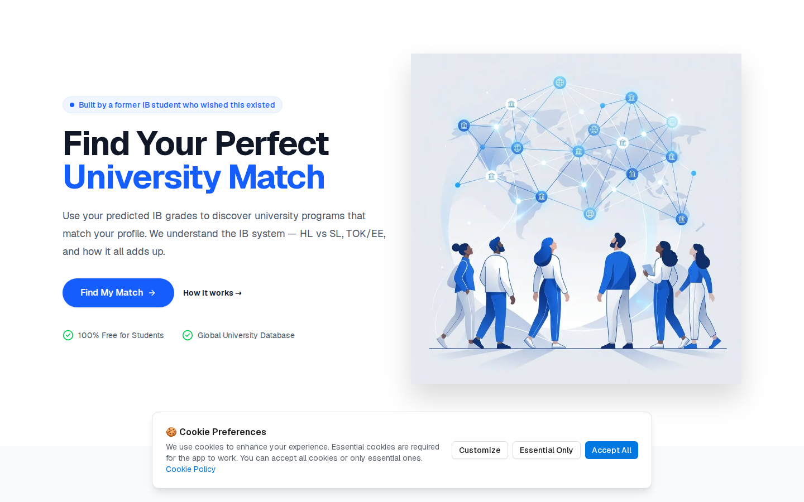

- **The logo is text, not artwork.** `public/logo-restored.svg` is a `#3573E5` square with "IB" and
  "Match" as live `<text>` set in Inter. An SVG loaded through `` cannot load web fonts, so the
  logo renders in whatever sans the visitor's system has. The favicon uses Arial. Outline the text
  (or rebuild the mark from paths) and add a horizontal lockup: mark plus "IB Match" wordmark.
- **The header logo is a 48px badge with an 8px "Match"** that is unreadable at that size, and
  there is no wordmark anywhere in the product.
- **Two brand blues.** The app's primary is `#3573E5`; the marketing pages and country guides use
  Tailwind's `blue-600`, `#155DFC`, 1,342 times. They sit side by side: the hero's blue headline
  and the cookie banner's "Accept All" button are different blues.
- **Imagery doesn't show the product.** The home and coordinator heroes are stock-style
  illustrations of people on a grey square (575 KB and 473 KB JPEGs named `.png`; the home hero
  also sets `quality={95}`). The landing page never shows a program card, a match score or a requirement,
  which are what make IB Match different.
- **No disclaimer.** Nothing on the site says IB Match is not affiliated with the International
  Baccalaureate Organization, while the name and logo lead with "IB". Add one line to the footer.
- **The social image is 1024×1024.** `summary_large_image` cards expect 1200×630; a square image is
  cropped.

**Proposal:** keep the blue square and "IB Match". Set the wordmark in the display face beside the
existing mark (see the header in every mockup), outline the SVG, and add the footer disclaimer.
A new mark, if wanted, is a separate brand decision and is not part of these tasks.

## 2. Colour

**Today**

- Public and student code uses **4,884 hard-coded Tailwind palette classes** (`text-gray-900`,
  `bg-blue-600`…) and **795 token classes** (`text-foreground`, `bg-primary`…). By area: country
  guides 4,258 hard-coded, 0 tokens; marketing pages and the landing ~460 hard-coded; the app
  itself (search, programs, student, components) is mostly tokens. Coordinator and admin are
  token-based (310 and 1,414 token classes).
- **Three grey ramps** are live at once: Tailwind `gray-*` (blue-tinted) on marketing pages, the
  shadcn neutral `#222` family in the app, and the typography plugin's neutral greys on legal pages.
- **Contrast.** The primary `#3573E5` on white is **4.43:1**, so white button labels and blue links
  fail AA at normal size. `text-blue-100` on the blue call-to-action band fails. axe found
  colour-contrast failures on 12 of 17 page types (208 elements across three widths). White
  initials (16px) fail 4.5:1 on all seven avatar colours, from 2.15:1 on amber to 4.43:1 on blue.
- **Status colour is inconsistent.** "Requirement met" is shown in brand blue, "partial" in Tailwind
  orange, "not met" in red. The match bar is always blue whatever the score; `getMatchRating()`
  computes a colour per tier that is never applied (`ProgramCard.tsx` lines 610 and 1051 render the
  label only).
- **Dark tokens exist but are shadcn's defaults** (the primary becomes white) and the root layout
  forces light mode (`<html className="light">`).

**Proposal** — full table in [`tokens/contrast.md`](tokens/contrast.md), tokens in
[`tokens/`](tokens/):

| Token | Light | Dark | Use |
| --- | --- | --- | --- |
| `primary` | `#1C62DD` (5.47:1) | `#629FFF` (7.28:1) | Buttons, links, selection, focus |
| `brand-mark` | `#3573E5` | `#3573E5` | Logo tile and large graphics only |
| `bg` / `surface` | `#F8FAFD` / `#FFFFFF` | `#050810` / `#090E18` | Page / cards, header, inputs |
| `fg` / `fg-muted` | `#141B27` / `#576171` (5.99:1 on `bg`) | `#F1F4F9` / `#959FAE` | Text / secondary text |
| `border` / `border-strong` | `#D6DDE6` / `#778190` (3.94:1) | `#262E3C` / `#778190` | Dividers / control outlines |
| `success`, `warning`, `danger` | `#047745`, `#9A5505`, `#BE2323` | `#70D79A`, `#FAC053`, `#FB9890` | Status text and icons, each with a `-soft` ground |
| `highlight` | `#FCE555` | `#FCE555` | The one accent: a highlighter-pen yellow for "Checked for 2027" and a marked word in headlines |

The brand blue moves slightly darker for text and buttons (`#1C62DD`) and keeps its exact logo
value for the mark. Neutrals are one cool ramp biased to the brand hue. The accent comes from the
subject: students highlight their notes, so the only accent is a highlighter yellow, always with
dark text. All 54 checked pairs pass in both themes.

## 3. Typography

**Today**

- **One family, Geist, loaded with `subsets: ['latin']` only.** Place names with Latin Extended
  letters fall back to another font for those glyphs: the live Charles University card reads
  "Prague, Hradec Králové, Plzeň", and the ň is not in the Latin subset (Łódź and České Budějovice
  are the same). Geist Mono is loaded and used once.
- **Ten font sizes in use** (`text-xs` to `text-6xl`), and the same role gets different sizes: the
  page H1 is 60px on marketing pages, 36px on FAQs and Contact, 30px on Search, University and the
  legal pages, and **24px on the program page**, the page where the title matters most.
- **Eyebrows are headings.** "Why IB Match?", "Program Database", "Recognition" are `<h2>` at 16px,
  while the visual section title under them is a `
`. Country guides then jump to `<h4>`
  ("Official Source"). axe flags heading order on search, contact and both guides.
- **Heavy weights**: 810 `font-semibold` and 369 `font-bold` against 203 `font-medium`.
- **Measure and alignment.** The program description runs about 170 characters per line at
  1440px (comfortable reading is 60–75). Marketing pages centre multi-line paragraphs on phones.
- **Small type for important facts.** Requirement status lines are `text-xs` (12px) with 10px icons.

**Proposal**

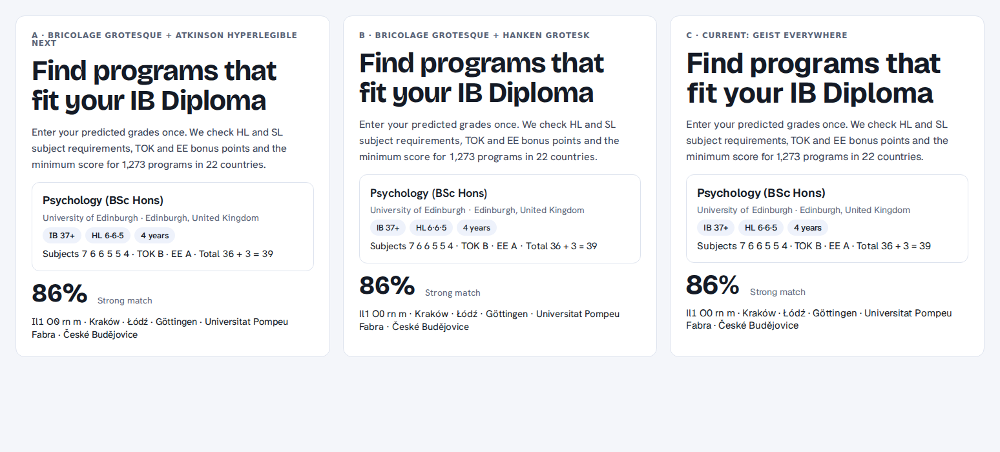

- **Bricolage Grotesque** for headings and big numbers: contemporary, warm at large sizes, a variable
  font with an optical-size axis.
- **Atkinson Hyperlegible Next** for text and interface: designed by the Braille Institute for
  legibility; I, l and 1, and O and 0, are distinct, which matters for "HL 6", "Il1" in course codes
  and grade tables.
- Both from Google Fonts through `next/font`, `latin` + `latin-ext`. Alternative B (Bricolage +
  Hanken Grotesk) is shown above if you prefer a more neutral text face; option C is today.
- A 14-step scale with fixed roles (full list in the design system): `display-2xl` 40–64px fluid
  for the marketing H1, `display-xl` 32–48px for marketing H2 and guide H1, `display-lg` 28–36px
  for every app page title, `heading-lg` 24px, `heading-md` 20px, `heading-sm` 18px, `body-lg` 18px,
  `body` 16px, `body-sm` 14px, `label` 15px, `caption` 13px, `overline` 12px, and `stat-xl` /
  `stat-md` for scores and points with tabular figures.
- Running text left-aligned and capped at 42rem (about 68 characters); headings balanced.

## 4. Layout, spacing and shape

- **Width.** Pages mix `container` (37 uses), `max-w-7xl` (270) and `max-w-3xl` (254) without a
  rule. Proposal: `container-wide` 1280px for marketing and the header, `container-app` 1200px for
  app pages, `container-prose` 42rem for text.
- **Radii.** Six radii are in heavy use (`rounded-xl` 325, `rounded-2xl` 253, `rounded-lg` 209,
  `rounded-full` 190…). Marketing buttons and the header's sign-in are pills; app buttons are 6px.
  Proposal: five radii with fixed roles; buttons always 10px; pills only for chips and avatars.
- **Button sizes.** Measured heights: 52px (marketing CTAs), 40–44px (FAQ, contact), 36px (app
  default), 32px (small). Proposal: 36 / 44 / 52px, with 44px the default for touch.
- **Double padding.** `Card` adds `py-6` and `ProgramCard` adds its own `p-6`, which leaves a
  48px gap above every search result image.
- **Heavy outlines.** Requirement and preference tiles use 2px borders. Proposal: 1px everywhere,
  `border-strong` where a control needs 3:1.

## 5. Navigation and information architecture

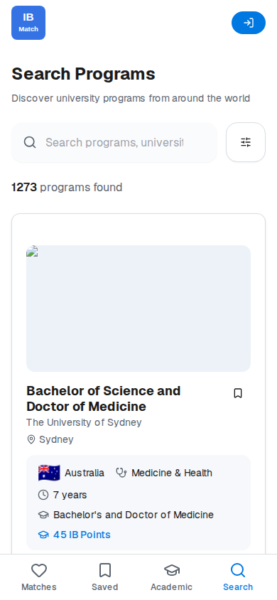

**Today**

- **No header on 30+ pages.** The home page, How it works, FAQs, For coordinators, Support us,
  Contact, the requirements hub and all 22 country guides render without a logo or navigation. A
  visitor who lands on a country guide from Google cannot reach search except through in-page CTAs.
- **Visitors see the student app.** Search, program pages and the legal pages use `StudentHeader`
  for everyone: "My Matches", "Saved Programs", "Academic Profile" and "Settings" all redirect a
  visitor to sign-in, and nothing links to the guides or How it works.
- **Dead ends.** University pages have no header, footer or `<main>`, only "Back to program", which
  calls `history.back()`. Program pages have no footer, and "← Back to results" also calls
  `history.back()`, which leaves the site for anyone who arrived from Google.
- **The mobile tab bar** is shown to signed-out visitors (three of four tabs lead to sign-in), hides
  while scrolling, and uses a `safe-area-inset-bottom` class that does not exist in Tailwind 4, so it
  sits under the iPhone home indicator. "Matches" uses a heart, which reads as favourites.
- **The 404 is Next.js's default**: black system text, no logo, no way back.
  
- **The footer** is one row of small links, missing on program and university pages, with no
  links to country guides.
- `components/shared/Header.tsx` and `Footer.tsx` are unused and link to pages that do not exist
  (`/programs`, `/about`, `/auth/signup`).

**Proposal**

- **One `SiteHeader`, two modes.** Visitors: Find programs, Country guides, How it works, For IB
  schools, then Sign in and "Get my matches". Students: Matches, Search, Saved, Country guides, a
  "Finish your profile" pill while onboarding is incomplete, and a profile menu (Academic profile,
  Settings, Sign out). On phones visitors get a menu sheet; students get the tab bar.
- **Tab bar for students only**: Matches (sparkles), Search, Saved, Profile; always visible; real
  safe-area padding.
- **Breadcrumbs** on program, university and guide pages (Programs / Country / University / Program)
  with `BreadcrumbList` JSON-LD, replacing `history.back()`.
- **A rich footer on every public page**: Students, Country guides, IB schools, About, and the
  non-affiliation line.
- **A branded 404 and error page** with search and the main links.

## 6. Program cards — one component everywhere

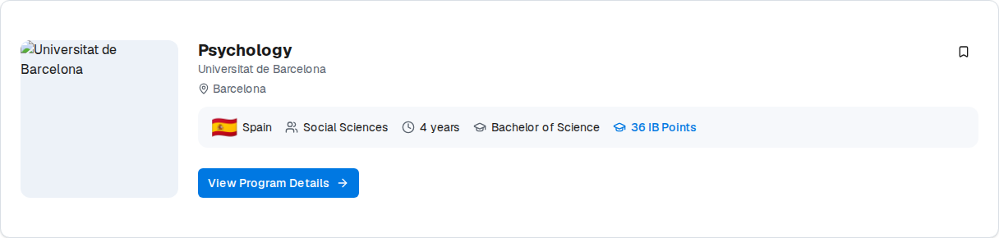

**What already works:** `components/student/ProgramCard.tsx` is shared by search, matches, saved,
the program page and two coordinator views. That is the right instinct and the refresh keeps it.

**What doesn't**

- **One file, two products.** 1,278 lines hold both the list card and the whole program page
  (`variant="detail"`). Behaviour is switched by booleans (`showMatchDetails`, `isCoordinatorView`,
  `isLoggedIn`). The requirement and preference tile markup is copied nine times.
- **Not quite everywhere.** The university page draws its own program tiles in
  `UniversityDetailClient.tsx`, so the same program looks different there.
- **The image dominates.** 192×192 on desktop and full-width 16:9 on phones, so a phone shows one
  result per screen and 50 results make an 11,526px page. When the image is missing the card shows
  an empty grey box.
- **The key fact is buried.** Minimum IB points is one of five equal chips, after country, field,
  duration and degree, and shares the graduation-cap icon with the degree. The flag is forced to
  26px by an inline style.
- **Fifty primary buttons.** Every card has "View Program Details" as a primary button, while the
  card's hover lift suggests the whole card is clickable (it is not; only the title and button are).
- **Match details are always expanded.** On the matches page each card adds a score bar, a
  requirements grid and a preferences grid, roughly 550–650px per card, with 12px status text and 10px
  icons. The bar is blue for a 35% match and for a 95% match.
- **Data shows through.** Degree types are inconsistent ("Bachelor", "BA", "Master", "Double
  Bachelor's Degree", "Bachelor's and Doctor of Medicine"), and mixed one-of groups print
  "Mathematics AA or Mathematics AI or Mathematics AA or…" with one level and grade (MAINT task 5.7).

**Proposal**

| | Before | After |
| --- | --- | --- |
| Desktop |  | 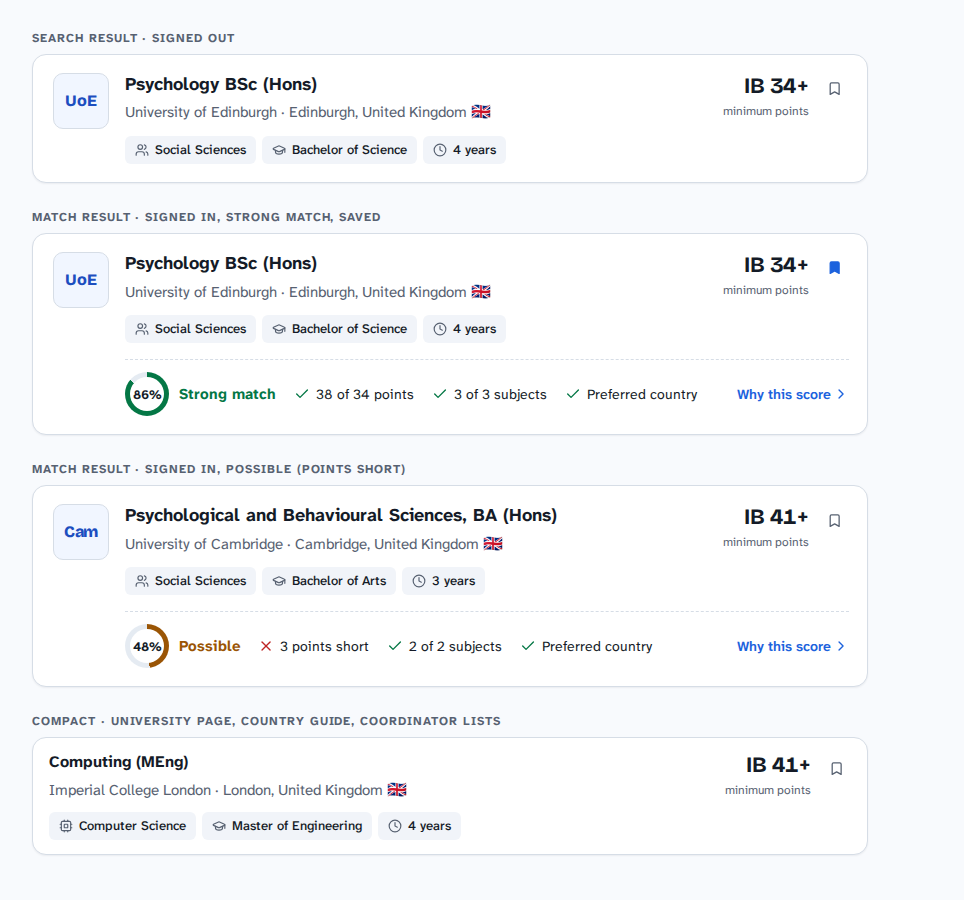 |
| Phone | 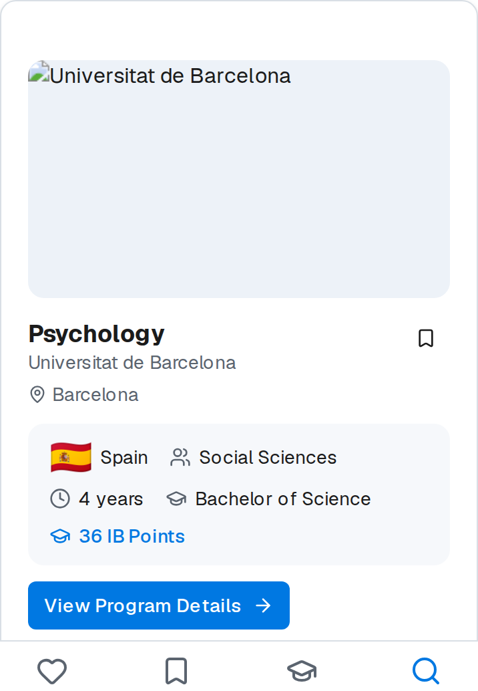 | 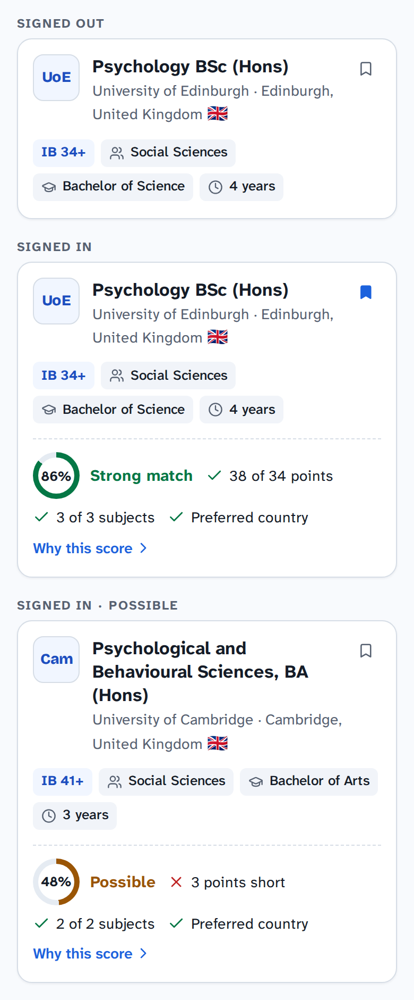 |

- **A family, not a monolith:** `components/program/` with `ProgramCard`, `UniversityLogo`
  (monogram fallback: "UoE", "UCD"), `MatchScore`, `MatchReasons`, `RequirementList`, `KeyFacts` and
  `SaveButton`. The program page composes the same parts instead of a `detail` variant.
- **Anatomy:** logo, program name (the card's one link, stretched over the card), university · city,
  country and flag, `IB 34+` as a stat, a save toggle, and three fact chips. Signed in, one row adds
  the score ring, three reasons ("38 of 34 points", "3 of 3 subjects", "Preferred country") and
  "Why this score". The detail grids move to the program page.
- **Container queries, not breakpoints.** The card responds to its own width, so the same component
  fits the results column, the 340px program-page sidebar and a phone. Below 520px the points move
  into the chips and the save button floats.
- **Variants:** `default` and `compact` (no logo) for university pages, country guides and
  coordinator lists. No other program list markup is allowed.

## 7. Search

| Before | After |
| --- | --- |
| 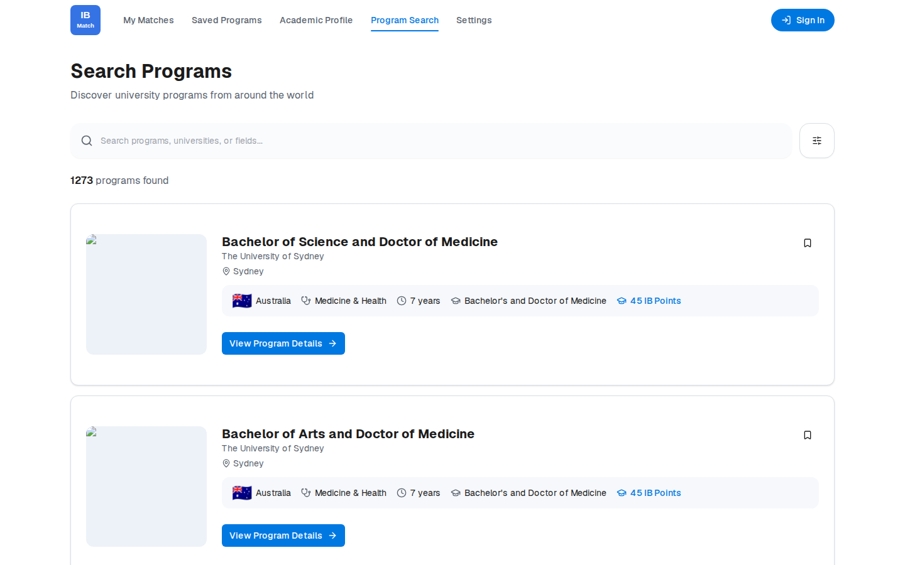 | 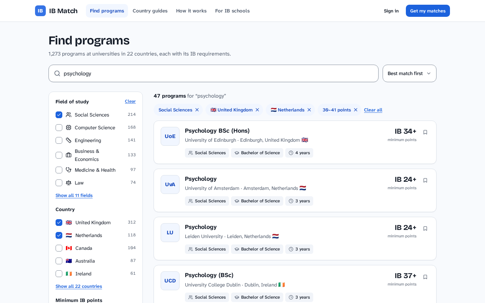 |

**Today**

- **Default order is highest minimum points first**, so every visitor's first page is 45-point
  medicine programs. Most IB students score 30–38.
- 50 large cards per page; no sort; pagination is Previous / Next only.
- Filters hide behind an icon-only button with no accessible name (axe `button-name`, critical);
  the clear-search button has none either. The search box has no label, only a placeholder. The
  filter panel lists every field and country as chips with no counts.
- The loading skeleton is a three-column grid; results are one column.

**Proposal**

- Desktop: a 280px filter sidebar (field, country, IB points range with the distribution, degree)
  with counts from Algolia facets; results in one 760px column; sort ("Best match", "Minimum points,
  low to high", "Name"); 20 per page with numbered, crawlable pages.
- Phone: search, a "Filters (4)" button opening a bottom sheet, sort, removable chips for applied
  filters, and compact cards (three to four per screen).
- Default order: relevance for a query; with no query, programs nearest the student's predicted
  points for signed-in students, and a mixed order for visitors.
- See `images/after/search-mobile.png` and `images/after/filters-sheet-mobile.png`.

## 8. Program page

| Before | After |
| --- | --- |
| 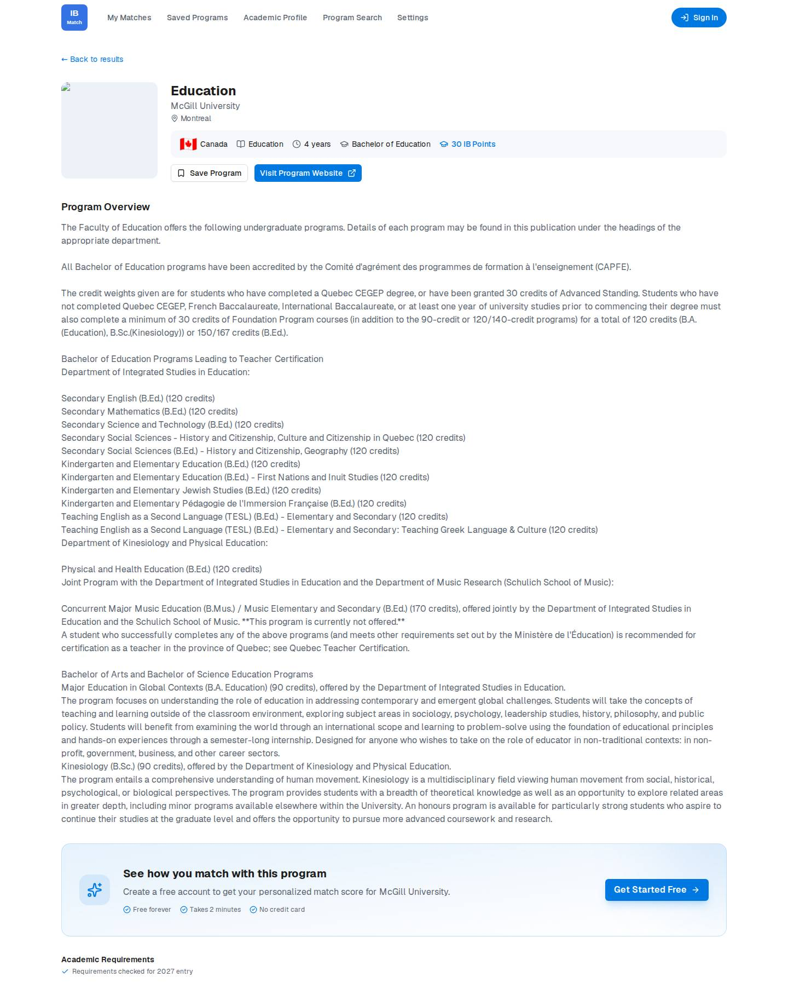 | 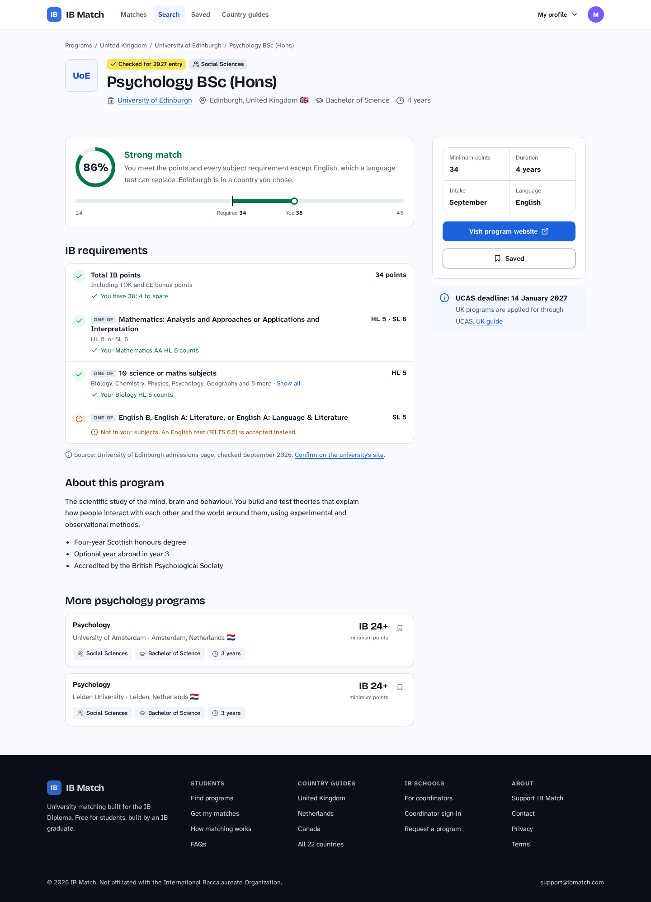 |

**Today:** a 24px H1; the description is printed as raw text with `whitespace-pre-line`, so markdown
shows literally ("\*\*This program is currently not offered.\*\*") and lines run 170 characters; the
academic requirements come last, after the description and a sign-up box; no footer.

**Proposal:** breadcrumbs; a header block (logo, name, university, location, degree, duration, a
"Checked for 2027 entry" badge); a main column with the match summary (score ring plus the 24–45
points scale showing required and predicted points), the requirement list with one-of groups shown
correctly, and the description rendered through the existing `MarkdownContent` at prose width; a
sticky 340px sidebar with key facts, "Visit program website" and Save; on phones a sticky action bar.
Similar programs use `ProgramCard compact`.

## 9. Onboarding — the academic profile

Reviewed from `app/student/onboarding/*`, `components/student/{FieldSelector, LocationSelector,
DetailedGradesInput, SubjectSelectorDialog}` and `components/ui/step-indicator.tsx`.

**Today**

- **Steps 1 and 2 cannot be used with a keyboard or screen reader.** Field and country tiles are
  `Card` divs with `onClick`: no `role`, no `tabIndex`, no key handling, no checked state. That fails
  WCAG 2.1.1 (Keyboard, level A). Each tile's name is also an `<h3>`, so the heading outline is a
  list of every field or country.
- **Nothing is saved until "Complete Profile".** A student who closes the tab on step 3 starts again.
- **The step is not in the URL.** Back leaves onboarding; refresh returns to step 1.
- **The step indicator hard-codes "Update Your Profile"**, also for a first-time student, shows a
  progress bar and numbered circles for the same thing, and draws exactly two connector lines.
- **Countries are 22 large tiles** (11 rows on a phone), with no search and no "anywhere" choice,
  although the step is optional.
- **Step 3 asks for six subjects through six dialogs**, each a three-step wizard (group → subject →
  level and grade), so about 24 taps. A grade cannot be edited; the subject must be removed and added
  again. Remove buttons have no label. TOK and EE grades are plain buttons without radio semantics,
  the section uses 📝 and 💡 as icons, and the total appears twice. A "quick score" path is kept as
  commented-out code.
- **The bonus calculation** differs from the official matrix: see FIX-1.

**Proposal**

| Step 1 on a phone | Step 3 on desktop |
| --- | --- |
| 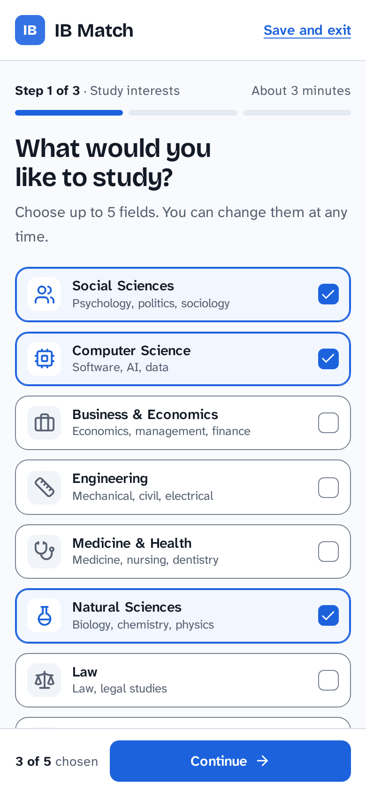 | 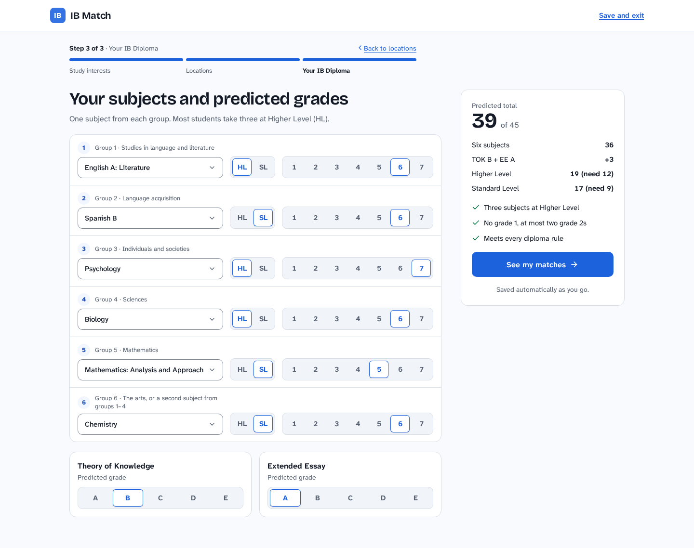 |

- Steps in the URL (`?step=1..3`) and saved as you go (fields and countries on Continue, grades on
  change), with "Save and exit".
- Step 1: `SelectableTile` checkboxes in one column on phones, two on desktop, limit stated ("3 of 5
  chosen"), sticky Continue bar.
- Step 2: country chips with flags, a search box and an "Anywhere" option.
- Step 3: one diploma form. Six rows, one per IB group, each with a subject select filtered to that
  group, an HL/SL segmented control and a 1–7 grade control; TOK and EE as A–E controls; a sticky
  summary with the live total (subjects + bonus), HL and SL sub-totals and every diploma rule as a
  checklist. The submit button says "See my matches".
- First visit says "Set up your profile"; a returning student sees "Edit your academic profile" and
  can jump between steps.

## 10. Matches, saved and settings

Reviewed from `app/student/{matches, saved, settings}`.

- **Matches** is a list of fully expanded cards under "Your Program Recommendations — We found N
  programs… Showing top N", with a "Refresh Recommendations" button at the bottom and a staggered
  entrance on every load. There is no way to filter by match strength, country or field, and no
  reminder of the profile the matches are based on.
- **Proposal** (`images/after/matches-mobile.png`): a one-line profile summary with Edit ("39 points
  · 3 HL · Psychology, CS · UK, NL"), tier chips with counts (All, Strong, Good, Possible), compact
  match cards, and no manual refresh: matches recompute when the profile changes.
- **Saved** and **Settings** have good loading, empty and error states; they need only the new
  components and tokens. Avatars should take their colour from a contrast-safe set.

## 11. Marketing pages and country guides

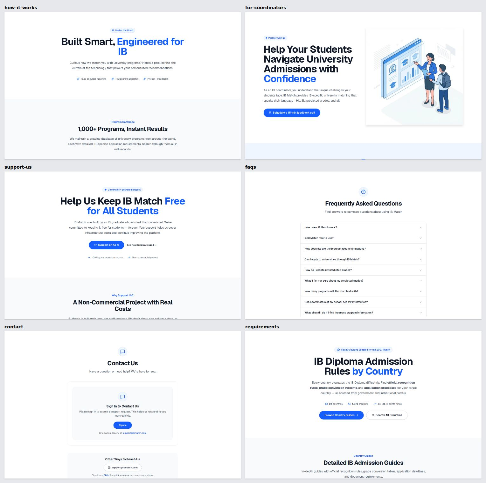

- **One hero, repeated.** Home, How it works, For coordinators, Support us and the requirements hub
  share the same template: eyebrow pill, 60px headline with a blue second line, centred paragraph,
  pill CTA. It reads as generic, and on phones the centred paragraphs are hard to read.
- **Vague claims where real numbers exist.** "Growing Daily", "100% Free", "1,000+ Programs", while
  the catalogue has 1,273 programs in 22 countries covering 24–45 points.
- **Contact requires sign-in** to send a message.
- **Country guides** are 9,400–15,500px single columns with no table of contents, many tinted
  callouts and 22 copy-pasted files (task 7.2 in `MAINT_tasks.md` collapses them into one route;
  restyle after that).
- **The cookie banner** is large, has three buttons and says "We use cookies to enhance your
  experience", while the code comment says only essential cookies are set. If that is still true,
  confirm with whoever handles legal questions whether the banner is needed at all; if it is, make it
  a slim bar.

**Proposal** (`images/after/landing-desktop.png`, `images/after/landing-mobile.png`): a header; a
hero that does something (predicted points + field → "See programs", no account needed); a product
preview with real cards instead of an illustration; a stats strip with real counts; three steps; a
country-guide grid; a dark band for coordinators; the rich footer. Marketing pages reuse these
sections instead of one hero template.

## 12. Accessibility

axe-core 4, WCAG 2.0/2.1/2.2 A and AA plus best practice, 17 page types × 3 widths:

| Rule | Impact | Page types | Elements | What it means here |
| --- | --- | --- | --- | --- |
| `color-contrast` | serious | 12 | 208 | Primary blue text and buttons (4.43:1), light blue on the CTA band, muted greys |
| `region` | moderate | 9 | 168 | Content outside landmarks (no header/main on many pages) |
| `landmark-one-main` | moderate | 8 | 24 | No `<main>`: FAQs, Contact, University, both sign-ins, legal pages, 404 |
| `heading-order` | moderate | 4 | 42 | Eyebrow `h2` then `h4`; card titles as `h3` under an `h1` |
| `link-name` | serious | 4 | 4 | Icon-only sign-in link on phones |
| `landmark-unique` | moderate | 3 | 9 | Several `nav` elements without names (header, tab bar, footer) |
| `link-in-text-block` | serious | 2 | 7 | Links told apart by colour only |
| `page-has-heading-one` | moderate | 2 | 6 | Sign-in pages have no `h1` |
| `button-name` | critical | 1 | 3 | The search filter toggle (the clear-search button, shown once you type, has no name either) |
| `target-size` | serious | 1 | 64 | Small links inside search result cards |

From code, beyond axe: onboarding tiles are not keyboard-operable (WCAG 2.1.1, level A); TOK/EE and
grade buttons have no radio semantics; remove-subject buttons are unlabelled; there is no skip link;
the tab bar overlaps the iPhone home indicator.

**Proposal:** fix the tokens (contrast), the shell (landmarks, skip link, one `h1`), the
controls (labels, roles) and add an axe gate for serious and critical issues on key pages in CI
(task DS-0 sets it up as a report, DS-23 makes it blocking).

## 13. Motion and performance notes

- Keep the existing reduced-motion handling. Stop staggering cards in on every load and animating
  the score bar from zero; animate state changes (a sheet opening, a bookmark filling) instead.
- Use React's `<ViewTransition>` to morph a card's title and logo into the program page; Next 16's
  App Router supports it without configuration (`node_modules/next/dist/docs/01-app/02-guides/view-transitions.md`).
- Re-export the hero images as real WebP or AVIF at sensible quality, or replace them with the
  product preview. Make the social image 1200×630.
- Make skeletons the shape of what they replace (a list of card skeletons on search).

## 14. Coordinator and admin areas

Both are built on shadcn tokens and are consistent internally. They inherit the new tokens and
primitives automatically once DS-1 and DS-3/DS-4 land. The coordinator's student-matches view must
use the new `ProgramCard` (DS-11). A full admin restyle is not proposed.

## 15. The proposal in one page

**Principles**

1. **IB first.** Points, HL/SL and grades are the content; design around them (the 24–45 scale, the
   points stat, the diploma form).
2. **One of everything.** One header, one footer, one program card, one token set. A second version
   of a component is a bug.
3. **Readable before pretty.** WCAG 2.2 AA in both themes, 16px text, 44px targets, left-aligned
   prose at 68 characters.
4. **Show the product.** Real programs and real numbers instead of illustrations and adjectives.
5. **Quiet surfaces, one accent.** Blue for action, status colours for status, highlighter yellow for
   freshness. Nothing else is coloured.

**Deliverables in this folder**

- `tokens/theme.css` — the Tailwind 4 theme to paste into `app/globals.css` (DS-1).
- `tokens/ibmatch.tokens.json` — the same tokens in W3C DTCG 2025.10 format.
- `tokens/contrast.md` — every token pair checked, light and dark.
- `mockups/*.html` — 14 static screens built from `mockups/components.css`; open them in a browser.
- `images/before/`, `images/after/` — the screenshots used in this report.
- `source/` — the scripts that generate the tokens, contrast table and mockups.

**All after-screens:** `images/after/` holds desktop and phone versions of search, the filter sheet,
the program page, matches, both onboarding steps, the landing page, the card states, and a dark-theme
sample (`search-mobile-dark.png`).

## 16. Found during the audit (not design)

- **FIX-1 — TOK/EE bonus points.** The official matrix awards A+A 3, A+B 3, A+C 2, A+D 2, B+B 2,
  B+C 2, B+D 1, C+C 1, C+D 0, D+D 0, and any E fails the diploma
  ([IB core points matrix](https://info.lanterna.com/resources/ib-core-points-matrix-explained-2026)).
  Onboarding (`FieldSelectorClient.tsx`, `DetailedGradesInput.tsx`) computes `tok + ee − 6` with
  A=5…E=1, which gives one point too few for A+D, B+C, B+D and C+C. The coordinator form
  (`StudentProfileForm.tsx`) sums A=3, B=2, C=1, D=0 capped at 3, which gives too many for A+C, A+D,
  B+B, B+C, B+D, C+C and C+D. The API stores the total the client sends, so stored totals and
  matches are affected. Fix in one shared, tested function before redesigning step 3.
- **Default search order** is highest points first (see §7).
- **Degree types** need normalising (a short label plus the full title) for chips and filters.
- **Contact requires sign-in.**
- **Dead code:** `components/shared/Header.tsx`, `components/shared/Footer.tsx`, the commented-out
  quick-score path, and Next's starter SVGs in `public/` (`file.svg`, `globe.svg`, `next.svg`,
  `vercel.svg`, `window.svg`).

## 17. Limits of this audit

- **Signed-in screens were not seen live.** Onboarding, matches, saved, settings and the
  coordinator area were reviewed from code. Running a local copy with a test student needs a local
  database and a local sign-in, which this session's permissions did not allow. DS-0 includes a way
  to capture these screens; until then, a quick look through your own signed-in session will confirm
  the onboarding findings.
- No analytics or user research was available, so priorities come from heuristics, standards and the
  content of the catalogue.
- University images were broken on the day and are excluded.
- Coordinator and admin areas were checked only for shared components.
