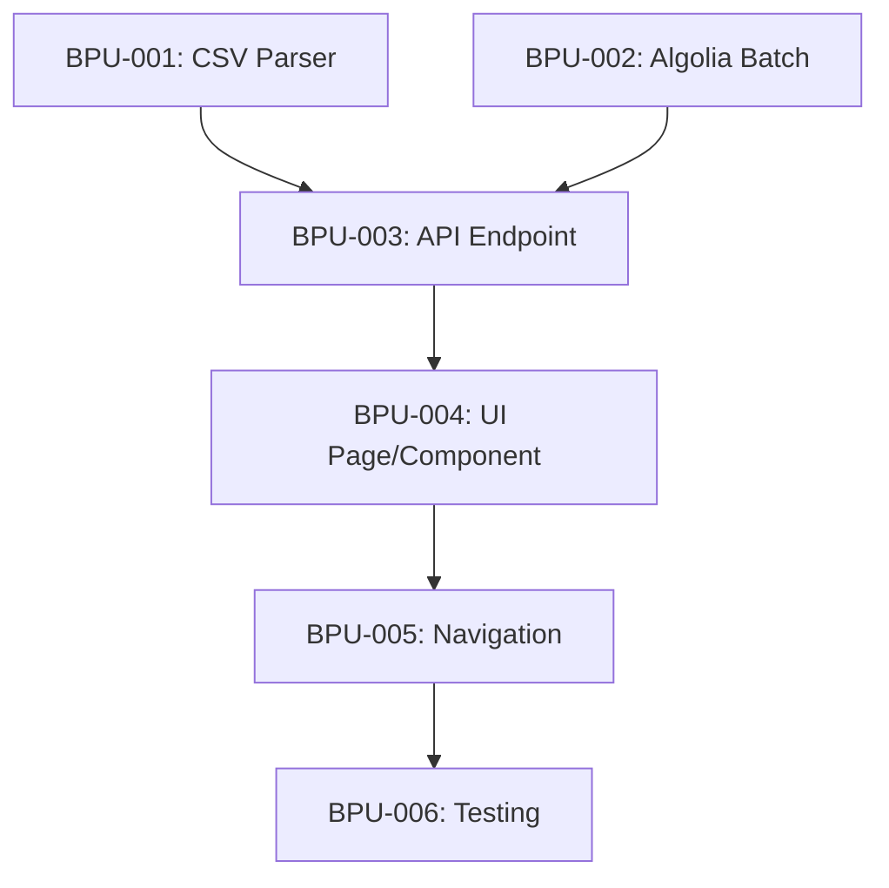

# Bulk Program Upload Feature - Implementation Plan

## Overview

This document outlines the implementation plan for a bulk program upload feature in the Admin dashboard. The feature will allow administrators to upload a CSV file containing multiple academic programs for a selected university, automating the program creation process while ensuring data consistency across the PostgreSQL database and Algolia search index.

## Current System Analysis

### Program Data Model (Prisma Schema)

Programs are represented in the database with the following key fields:

```
AcademicProgram
├── id (cuid)
├── name
├── description
├── universityId → University
├── fieldOfStudyId → FieldOfStudy
├── degreeType (Bachelor, Master, PhD, etc.)
├── duration (e.g., "3 years")
├── minIBPoints (nullable, 24-45)
├── programUrl (nullable)
├── selectivityTier (nullable, 1-4)
├── requirementsVerified (boolean)
└── courseRequirements[] → ProgramCourseRequirement
```

### Course Requirements Structure

```
ProgramCourseRequirement
├── ibCourseId → IBCourse
├── requiredLevel (HL/SL)
├── minGrade (1-7)
├── isCritical (boolean)
└── orGroupId (nullable - groups are OR alternatives)
```

**OR Logic**: Requirements with the same `orGroupId` are alternatives (student needs to meet ONE). Requirements with `orGroupId = null` are standalone AND requirements.

### Algolia Integration

Programs are synced to Algolia via:
- `syncProgramToAlgolia(programId)` - single program sync
- `syncAllProgramsToAlgolia()` - bulk sync all programs
- `deleteProgramFromAlgolia(programId)` - remove from index

The Algolia record includes flattened data with nested reference objects for fields, countries, and course requirements.

### IB Course Reference Data

Courses are identified by:
- `id` (cuid)
- `name` (e.g., "Mathematics: Analysis and Approaches")
- `code` (e.g., "MAT_AA")
- `group` (1-6 for IB curriculum groups)

---

## Proposed CSV Format

### Design Principles

1. **Simplicity**: University is selected in UI, not in CSV
2. **Readability**: Column names match UI form labels
3. **Flexibility**: Course requirements use a structured notation
4. **Safety**: Validate all references before creation

### CSV Structure

| Column | Required | Format | Example |
|--------|----------|--------|---------|
| `name` | ✅ | String | Computer Science |
| `description` | ✅ | String | A comprehensive program in... |
| `field_of_study` | ✅ | Exact name match | Engineering & Technology |
| `degree_type` | ✅ | Bachelor/Master/PhD/Diploma/Certificate | Bachelor |
| `duration` | ✅ | String | 3 years |
| `min_ib_points` | ❌ | Number (24-45) | 36 |
| `program_url` | ❌ | URL | https://... |
| `course_requirements` | ❌ | Structured notation | See below |

### Course Requirements Notation

Requirements are specified in a compact notation using the **exact course codes from the `IBCourse` table**:

```
COURSE_CODE:LEVEL:MIN_GRADE[:CRITICAL]
```

Multiple requirements are separated by semicolons (`;`). OR alternatives are wrapped in parentheses with pipe (`|`) separators.

> [!IMPORTANT]
> Course codes must **exactly match** values in the database. Invalid codes will cause the entire file to be rejected during validation.

**Valid Course Codes** (from your database):
- `MATH-AA` (Mathematics: Analysis and Approaches)
- `MATH-AI` (Mathematics: Applications and Interpretation)
- `PHYS` (Physics)
- `CHEM` (Chemistry)
- `BIO` (Biology)
- `CS` (Computer Science)
- `ECON` (Economics)
- `PSYCH` (Psychology)
- `HIST` (History)
- `ENG-LIT`, `ENG-LL` (English A)
- `SPA-B`, `FRA-B` (Languages)
- `BUS-MGMT` (Business Management)
- `VISUAL-ARTS`, `MUSIC` (Arts)

**Examples**:

1. **Single requirement (AND)**:
   ```
   MATH-AA:HL:5
   ```
   → Mathematics A&A HL, minimum grade 5

2. **Multiple AND requirements**:
   ```
   MATH-AA:HL:5;PHYS:HL:5
   ```
   → Math A&A HL 5 AND Physics HL 5

3. **OR group (alternatives)**:
   ```
   (MATH-AA:HL:5|MATH-AI:HL:6)
   ```
   → Math A&A HL 5 OR Math A&I HL 6

4. **Combined AND + OR**:
   ```
   (MATH-AA:HL:5|MATH-AI:HL:6);PHYS:HL:5:critical
   ```
   → (Math A&A HL 5 OR Math A&I HL 6) AND Physics HL 5 (critical)

5. **Critical subject**:
   ```
   PHYS:HL:5:critical
   ```
   → Physics HL 5 marked as critical

### Sample CSV

```csv
name,description,field_of_study,degree_type,duration,min_ib_points,program_url,course_requirements
Computer Science,A comprehensive program in software engineering.,Engineering & Technology,Bachelor,3 years,36,https://university.edu/cs,"(MATH-AA:HL:5|MATH-AI:HL:6)"
Mechanical Engineering,Study of mechanical systems and thermodynamics.,Engineering & Technology,Bachelor,4 years,35,,"PHYS:HL:5:critical;(MATH-AA:HL:5|MATH-AI:HL:5)"
Business Administration,Foundation in business management.,Business & Management,Bachelor,3 years,32,,
```

---

## User Flow

### Step 1: Navigate to Bulk Upload

1. Admin accesses new menu item: **Admin Dashboard → Programs → Bulk Upload**
2. URL: `/admin/programs/bulk-upload`

### Step 2: Select University

1. Admin selects university from dropdown (with country flags)
2. This reduces file complexity and ensures all programs go to one university

### Step 3: Upload CSV File

1. Drag-and-drop or click to upload CSV file
2. File validation:
   - Max size: 5MB
   - Format: CSV only
   - Headers validated against expected schema

### Step 4: Pre-Import Validation (STRICT)

> [!IMPORTANT]
> **Validation is a GATE before import.** If ANY row fails validation, the ENTIRE file is rejected. Admin must fix the CSV and re-upload. This ensures data integrity and prevents partial imports with inconsistent data.

1. System parses CSV and validates ALL rows against reference data:
   - **Field of Study**: Must EXACTLY match a value from `FieldOfStudy.name` table (case-insensitive)
   - **IB Course Codes**: Must EXACTLY match values from `IBCourse.code` table
   - **Degree Type**: Must be one of: Bachelor, Master, PhD, Diploma, Certificate
   - **IB Points**: Must be 24-45 if provided
   - **Grade Values**: Must be 1-7

2. Preview table displays:
   - Parsed data (name, field, requirements summary)
   - Validation status per row (✅ valid, ❌ error)
   - Specific error messages for each invalid field

3. **File Rejection Logic**:
   - ❌ **Any row invalid** → Import button DISABLED, file must be fixed and re-uploaded
   - ✅ **All rows valid** → Import button ENABLED, admin can proceed

**Example Validation Errors**:
| Row | Field | Error |
|-----|-------|-------|
| 3 | `field_of_study` | "Med Studies" not found. Valid values: Medicine, Health & Medicine, ... |
| 5 | `course_requirements` | Course code "MATH" not found. Did you mean "MAT_AA" or "MAT_AI"? |
| 7 | `min_ib_points` | Value "50" out of range. Must be 24-45. |

### Step 5: Import Execution

1. Admin clicks "Import Programs" (only enabled when ALL rows are valid)
2. System displays progress:
   - Creating programs in database
   - Syncing to Algolia
3. Final summary:
   - ✅ X programs created successfully
   - ❌ X programs failed with runtime errors (e.g., duplicates)

### Step 6: Post-Import

1. If any runtime failures (e.g., duplicate program names), admin can download error report
2. Link to view imported programs (filtered by university)

---

## Proposed Changes

### Navigation Update

#### [MODIFY] [AdminSidebar.tsx](file:///Users/pavel/match/components/admin/AdminSidebar.tsx)

Add a submenu or secondary link for bulk upload under Programs, or add as a separate menu item "Bulk Upload" with an upload icon.

---

### New Page

#### [NEW] [page.tsx](file:///Users/pavel/match/app/admin/programs/bulk-upload/page.tsx)

Server component that:
1. Fetches universities list for dropdown
2. Fetches fields of study for validation
3. Fetches IB courses for requirement parsing
4. Renders the `BulkUploadForm` client component

---

### New Client Component

#### [NEW] [BulkUploadForm.tsx](file:///Users/pavel/match/components/admin/programs/BulkUploadForm.tsx)

Client component (~600 lines estimated) with:

**State Management**:
- Selected university ID
- Uploaded file
- Parsed programs array
- Validation results
- Upload progress
- Error/success states

**Features**:
- University selector dropdown
- CSV file input with drag-and-drop zone
- CSV parsing (using `papaparse` library or native parsing)
- Requirements notation parser
- Preview table with validation status
- Progress indicator during import
- Error report download

---

### New API Endpoint

#### [NEW] [route.ts](file:///Users/pavel/match/app/api/admin/programs/bulk/route.ts)

`POST /api/admin/programs/bulk`

**Request Body**:
```typescript
{
  universityId: string
  programs: Array<{
    name: string
    description: string
    fieldOfStudyId: string
    degreeType: string
    duration: string
    minIBPoints?: number
    programUrl?: string
    courseRequirements?: Array<{
      ibCourseId: string
      requiredLevel: 'HL' | 'SL'
      minGrade: number
      isCritical: boolean
      orGroupId?: string
    }>
  }>
}
```

**Response**:
```typescript
{
  success: number
  failed: number
  results: Array<{
    name: string
    status: 'created' | 'error'
    programId?: string
    error?: string
  }>
}
```

**Implementation**:
1. Validate admin role
2. Verify university exists
3. Process programs in batches (10 at a time) using Prisma transactions
4. For each program:
   - Check for duplicate name at university
   - Create program with course requirements
   - Sync to Algolia
5. Return detailed results

---

### New Utility Module

#### [NEW] [csv-parser.ts](file:///Users/pavel/match/lib/bulk-upload/csv-parser.ts)

**Functions**:

```typescript
// Parse CSV content into program objects
parseCSV(content: string): ParseResult

// Parse course requirements notation
parseRequirements(notation: string, courseMap: Map<string, string>): ParsedRequirement[]

// Validate field of study name
validateField(name: string, fields: FieldOfStudy[]): string | null

// Validate complete program data
validateProgram(program: ParsedProgram, context: ValidationContext): ValidationResult
```

---

### Existing Module Updates

#### [MODIFY] [sync.ts](file:///Users/pavel/match/lib/algolia/sync.ts)

Add batch sync function for efficiency:

```typescript
// Sync multiple programs to Algolia in batch
async function syncProgramsBatch(programIds: string[]): Promise<{
  success: number
  failed: number
}>
```

This utilizes Algolia's `saveObjects` for better performance with bulk operations.

---

## Reference Data Mapping

To support the CSV format, the system will need to map:

### Field of Study Mapping

Admin provides exact field name (e.g., "Engineering & Technology") which is matched case-insensitively against the `FieldOfStudy.name` column.

**Current fields** (from reference data):
- Arts & Humanities
- Business & Management
- Engineering & Technology
- Health & Medicine
- Law
- Natural Sciences
- Social Sciences
- Education
- Computer Science
- Architecture & Design
- Environmental Studies
- Mathematics

### IB Course Code Mapping

Course codes are matched against `IBCourse.code`. The parser will:
1. Convert to uppercase for matching
2. Support common aliases (e.g., "MATH" → "MAT_AA")
3. Return detailed error for unknown codes

---

## Error Handling

### Validation Errors (Pre-Import)

| Error Type | Message | User Action |
|------------|---------|-------------|
| Missing required field | "Row 3: Missing required field 'name'" | Fix CSV |
| Unknown field of study | "Row 5: Field 'Computer Engineering' not found" | Use exact field name |
| Unknown course code | "Row 7: Course code 'MATH_HL' not found" | Check IB course codes |
| Invalid IB points | "Row 9: IB points must be 24-45, got '50'" | Fix value |
| Invalid grade | "Row 11: Grade must be 1-7, got '8'" | Fix value |
| Malformed requirements | "Row 13: Invalid requirements syntax" | Check notation |

### Import Errors (During Creation)

| Error Type | Handling |
|------------|----------|
| Duplicate program name | Skip, report in results |
| Database error | Rollback transaction, report |
| Algolia sync failure | Log warning, program still created |

---

## Technical Considerations

### Performance

1. **Batch Processing**: Process programs in batches of 10 to avoid timeouts
2. **Prisma Transactions**: Use transactions for data consistency
3. **Algolia Batch Sync**: Use `saveObjects` for bulk indexing (up to 1000 records)
4. **Progress Streaming**: Consider using Server-Sent Events for real-time progress

### Security

1. **Admin Only**: Require `PLATFORM_ADMIN` role
2. **File Validation**: Strict CSV format, max 5MB
3. **Input Sanitization**: Validate all string inputs
4. **Rate Limiting**: Limit to 1 bulk upload per minute

### File Size Limits

- Max file size: 5MB
- Max programs per upload: 500
- Max course requirements per program: 20

---

## Dependencies

### New Dependencies

```json
{
  "papaparse": "^5.4.1"  // CSV parsing (optional, can use native)
}
```

**Recommendation**: Use native JavaScript CSV parsing to avoid adding dependencies. The format is simple enough for a custom parser.

---

## Verification Plan

### Automated Testing

No existing test suite was found in the codebase for API endpoints. The verification will focus on manual testing.

### Manual Verification

#### 1. Navigation Test

**Steps**:
1. Log in as admin at `/auth/admin`
2. Navigate to Admin Dashboard
3. Verify new "Bulk Upload" menu item or link exists under Programs
4. Click to navigate to `/admin/programs/bulk-upload`
5. Verify page loads with university dropdown and file upload zone

**Expected Result**: Page loads successfully with all UI elements visible.

#### 2. CSV Upload Test (Happy Path)

**Steps**:
1. Navigate to `/admin/programs/bulk-upload`
2. Select a university from dropdown
3. Upload a valid test CSV file with 3-5 programs
4. Verify preview table shows all programs with ✅ status
5. Click "Import Programs"
6. Verify progress indicator shows
7. Verify success message with count

**Test CSV**:
```csv
name,description,field_of_study,degree_type,duration,min_ib_points,program_url,course_requirements
Test Program 1,Test description for program 1.,Computer Science,Bachelor,3 years,36,,
Test Program 2,Test description for program 2.,Business & Management,Master,2 years,34,,
Test Program 3,Test description for program 3.,Engineering & Technology,Bachelor,4 years,38,,"MAT_AA:HL:5"
```

**Expected Result**: All 3 programs created successfully.

#### 3. Validation Test (Error Cases)

**Steps**:
1. Navigate to `/admin/programs/bulk-upload`
2. Select a university
3. Upload CSV with intentional errors:
   - Row with missing name
   - Row with invalid field of study
   - Row with malformed requirements
4. Verify preview shows appropriate error messages for each row
5. Verify "Import" button is disabled or shows warning

**Expected Result**: Clear error messages for each invalid row.

#### 4. Database Verification

**Steps**:
1. After successful import, query database:
   ```sql
   SELECT * FROM "AcademicProgram" WHERE "universityId" = '<test-university-id>' ORDER BY "createdAt" DESC LIMIT 10;
   ```
2. Verify all imported programs exist with correct data
3. Verify `ProgramCourseRequirement` records for programs with requirements

**Expected Result**: Database contains all imported programs with correct relations.

#### 5. Algolia Verification

**Steps**:
1. After successful import, go to Algolia dashboard
2. Search for newly imported program names
3. Verify programs appear in search results
4. Verify nested data (field, country) is correct

**Expected Result**: All imported programs searchable in Algolia.

#### 6. Duplicate Prevention Test

**Steps**:
1. Try to upload a CSV with a program name that already exists at the selected university
2. Verify error message indicates duplicate

**Expected Result**: Duplicate programs are rejected with clear error.

---

## Task List

> [!NOTE]
> Tasks are numbered with `BPU-XXX` prefix (Bulk Program Upload). Dependencies are noted where applicable.

---

### BPU-001: CSV Parser Utility

**Goal**: Create the parsing and validation library for bulk upload

**Expected Outcome**: 
- New file: `lib/bulk-upload/csv-parser.ts`
- Functions for CSV parsing, requirements notation parsing, and strict validation
- Returns detailed validation errors with row/field context

**Key Functions**:
- `parseCSV(content: string): ParseResult`
- `parseRequirements(notation: string, courseMap: Map<string, string>): ParsedRequirement[]`
- `validateProgram(program: ParsedProgram, context: ValidationContext): ValidationResult`

---

### BPU-002: Algolia Batch Sync Enhancement

**Goal**: Optimize Algolia sync for bulk operations

**Expected Outcome**: 
- Modified file: `lib/algolia/sync.ts`
- New function: `syncProgramsBatch(programIds: string[])`
- Uses Algolia's `saveObjects` for efficient batch indexing

**Dependency**: None (can be done in parallel with BPU-001)

---

### BPU-003: Bulk Upload API Endpoint

**Goal**: Implement the server-side bulk creation logic

**Expected Outcome**: 
- New file: `app/api/admin/programs/bulk/route.ts`
- `POST /api/admin/programs/bulk` endpoint
- Batch processing with Prisma transactions
- Integrates with `syncProgramsBatch()` for Algolia sync
- Returns detailed success/failure results

**Dependencies**: BPU-001 (for validation types), BPU-002 (for batch sync)

---

### BPU-004: Bulk Upload Page & Component

**Goal**: Create the admin UI for bulk upload

**Expected Outcome**: 
- New file: `app/admin/programs/bulk-upload/page.tsx` (server component)
- New file: `components/admin/programs/BulkUploadForm.tsx` (client component)
- University selector dropdown
- File upload with drag-and-drop
- Preview table with validation status
- Import progress and results display

**Dependencies**: BPU-001 (for client-side validation), BPU-003 (for API integration)

---

### BPU-005: Navigation Update

**Goal**: Add bulk upload access to admin navigation

**Expected Outcome**: 
- Modified file: `components/admin/AdminSidebar.tsx`
- New "Bulk Upload" link under Programs section (or separate menu item with Upload icon)

**Dependencies**: BPU-004 (page must exist first)

---

### BPU-006: Testing & Verification

**Goal**: Validate the complete feature works end-to-end

**Expected Outcome**: 
- All manual verification tests pass (see Verification Plan section above)
- Programs created correctly in PostgreSQL database
- Programs indexed correctly in Algolia
- Validation errors displayed clearly for invalid CSV files

**Dependencies**: All previous tasks (BPU-001 through BPU-005)

---

## Implementation Order



**Recommended Execution Order**:
1. BPU-001 + BPU-002 (parallel - no dependencies)
2. BPU-003 (depends on 001 + 002)
3. BPU-004 (depends on 003)
4. BPU-005 (depends on 004)
5. BPU-006 (final verification)
